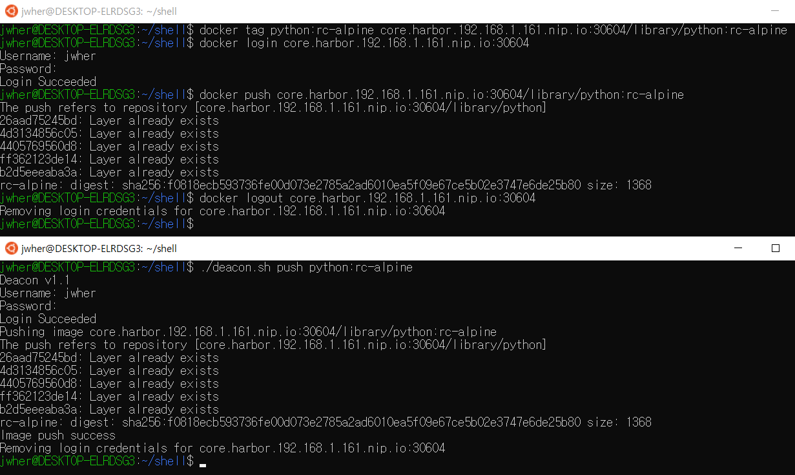

# Deacon

docker private registry helper  
  
*Deacon help you with a short command for docker private registry*

# usage
./deacon.sh [Command] [Flags]  

`pull`    : Pull an image or a repository from a registry  
`push`    : Push an image or a repository to a registry  
`login`   : Log in to a Docker registry  
`logout`  : Log out from a Docker registry  

<br/>

./deacon.sh [push/pull] [ImageName] [Flags]  

`--user`       `-u`: User ID  
`--password`   `-p`: password  
`--registry`   `-r`: registry URL  
`--config`     `-c`: `.config` location  
`--help`       `-h`: help  

# customize

you can customize your own registry by setting a DEFAULT_REG [value](https://github.com/JWHer/Harbor-Deacon/blob/95d1b5b171c093fb7ea2e0e1750fe48e01fead51/deacon.sh?plain=1#L5-L6)  

```shell
# set your own default registry here
DEFAULT_REG="core.harbor.192.168.1.161.nip.io:30604"
```

# Update log
latest version: v1.13

## v1.13
Bug fix
* WSL error fixed: line 35 fixed (Microsoft->microsoft, bug)
* WSL error fixed: line 62 fixed (line 35)
* `push` bug fixed: line 274 fixed (#->push, bug)

Add features  
* Check required packages.(jq requried)

## v1.12
* `-u` option no longer implicitly uses the "user" repository.
Deacon always use the library repository as the default.
* Add `login` `logout` commands.  
* refactoring.

## v1
* Tested with Harbor.  
* Support WSL but had an error. (fixed v1.13)  

# 디콘

도커 프라이빗 레지스트리 도우미  
docker wrapper shell로 짧은 명령어와 일반 사용자가 실수하기 쉬운 부분을 도와줍니다.  

# 개인화

DEFAULT_REG [값](https://github.com/JWHer/Harbor-Deacon/blob/95d1b5b171c093fb7ea2e0e1750fe48e01fead51/deacon.sh?plain=1#L5-L6)
을 변경해 개인 레지스트리로 설정할 수 있습니다.  

```shell
# set your own default registry here
DEFAULT_REG="core.harbor.192.168.1.161.nip.io:30604"
```

# 업데이트 로그
최신 버전: v1.13

## v1.13
버그 픽스
* WSL오류 해결: line 35 fixed. (Microsoft->microsoft, bug)
* WSL오류 해결: line 62 fixed. (line 35)
* `push` 버그 해결: line 274 fixed. (#->push, bug)

기능 추가
* 리눅스 패키지 체크. (jq requried)

## v1.12
* `-u` 옵션 사용시에도 library 레포지토리를 사용합니다.  
* `login` `logout` 명령어를 추가했습니다.  
* 리팩토링.

## v1
* Harbor로 테스트 하였습니다.  
* WSL도 지원하나 오류가 있습니다. (v1.13 에서 수정됨)  
